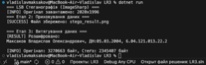

# Application_and_data_security_LR3
Консольна утиліта для стеганографічного приховування текстової інформації у зображеннях формату PNG. Програма реалізує класичний метод **LSB (Least Significant Bit)**, змінюючи молодші біти колірних каналів пікселів.

## 📋 Функціональні можливості

* **Приховування даних (Encoding):** Інтеграція довільного тексту (включаючи кирилицю та спецсимволи) у зображення.
* **Витягування даних (Decoding):** Зчитування та відновлення прихованого тексту зі стегоконтейнера.
* **«Розумна» зупинка:** Використання нуль-термінатора (`\0`) для автоматичного визначення кінця повідомлення.
* **Кросплатформенність:** Використання бібліотеки **SixLabors.ImageSharp**, що забезпечує коректну роботу на Windows, macOS та Linux.
* **Аналіз:** Порівняння розмірів файлів до та після обробки.

## 🛠 Технологічний стек

* **Мова:** C# (.NET 6.0 / 7.0 / 8.0)
* **Бібліотека обробки зображень:** `SixLabors.ImageSharp`
* **Формат зображень:** PNG (Lossless compression)

## 🚀 Налаштування та Запуск

### 1. Встановлення бібліотеки
Програма використовує зовнішню бібліотеку для роботи з пікселями. Вам необхідно встановити пакет **`SixLabors.ImageSharp`**.

Це можна зробити через вбудований у вашу IDE менеджер пакетів (NuGet Package Manager):
1.  Знайдіть меню "Manage NuGet Packages".
2.  Введіть у пошук `SixLabors.ImageSharp`.
3.  Натисніть "Install" (Встановити).

### 2. Підготовка файлу
Перед запуском відкрийте файл `Program.cs` та переконайтеся, що змінна `originalImagePath` вказує на правильний шлях до вашого зображення на диску:
string originalImagePath = "/Users/vladislavmaksakov/.../Encode.png";

### 3. Запуск програми
Запуск виконується засобами вашого середовища розробки (Visual Studio, VS Code або Rider):

1.  Відкрийте проект.
2.  Натисніть кнопку **Run** (зелений трикутник "Start" або "Play") на панелі інструментів.
3.  Результат виконання з'явиться у вікні виводу (Output) вашої IDE.

**Програма автоматично:**
* Завантажить фото.
* Приховає текст.
* Збереже результат як `stego_result.png`.
* Перевірить результат, розшифрувавши його назад.

---

## 📸 Результати роботи

### 1. Процес виконання
*Логи успішного виконання програми у вікні IDE.*

### 2. Візуальне порівняння
*Зліва — оригінал, справа — стегоконтейнер. Візуальних відмінностей немає.*

| Оригінал | Стегоконтейнер |
|----------|----------------|
|  |  |

---

## 👨‍💻 Автор
**Студент:** Максаков Владислав Олександрович  
**Група:** 6.04.121.013.22.2  
**Дата:** 2026 рік